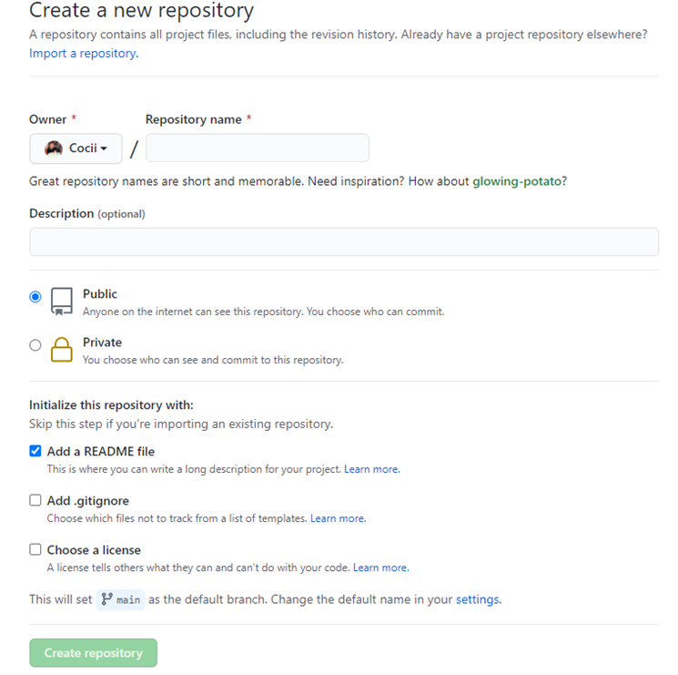
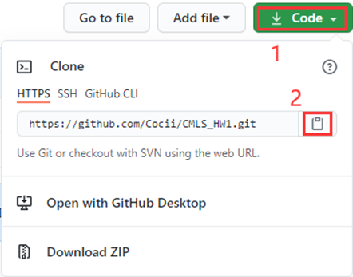
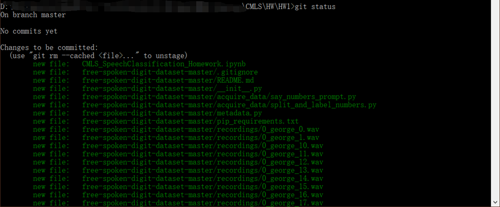
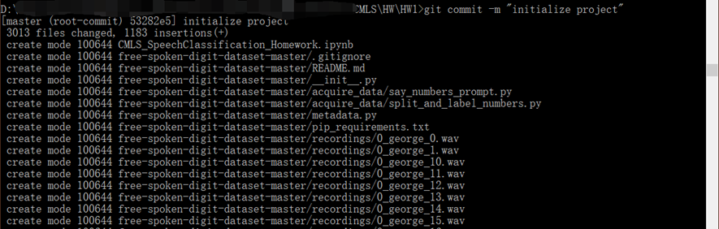
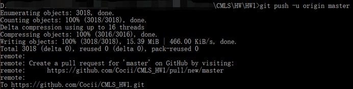

**1.**   **First you need to create a new repository on github**

Then copy the repository address which will be used later

### 2.   Then go to the directory of the project you want to upload and execute the git init command.

The execution will generate a .git hidden file.

`cd ~/Cocii/CMLS_HW1/`

`git init`

### 3.   Then execute the `git add .` command. (There is a dot . !!!)

Indicates that all files in the directory are added to the local staging area. There will be no prompt after successful execution.  compares your local file with the version in the staging area.

And you can excute the git status , it compares your local file with the version in the staging area.

As the figure shows that all files have been added to the staging area, but not yet committed to the local history area.

|      |                           |
| ---- | ------------------------- |
|      |  |

 

 

 

 

 

 

 

 

 

 

 

 

 

 

 

### 4.   Execute the `git commit -m "initialize project"` command.

The **"initialize project"** is the note. You can write anything. This command will commit the files in the local staging area to the local history area, and only the content in the local history area can be committed to github. after executing this command, all our files are just local. There is no relation to github.

|      |                           |
| ---- | ------------------------- |
|      |  |

 

 

 

 

 

 

 

### 5.   Then execute the `git remote add origin https://github.com/yourRepository.git` command. (The most important step)

You can get your repository address in step 1.

This command adds files from the local history section to the staging area of the github server. This step is the one that establishes the connection between the local and remote servers. There will be no prompt after successful execution.

 

### 6.   Execute the command (Not necessary if it is the first commit) `git pull origin master --allow-unrelated-histories`

The command is to pull down the files on github first, note that in order to prevent conflicts before each commit you have to do a pull first.

### 7.   Execute the command `git push -u origin master`

This step will actually commit the local code to the github repository. After the execution is complete, go to your github and see that the repository will have the same code as your local one.

 

 
